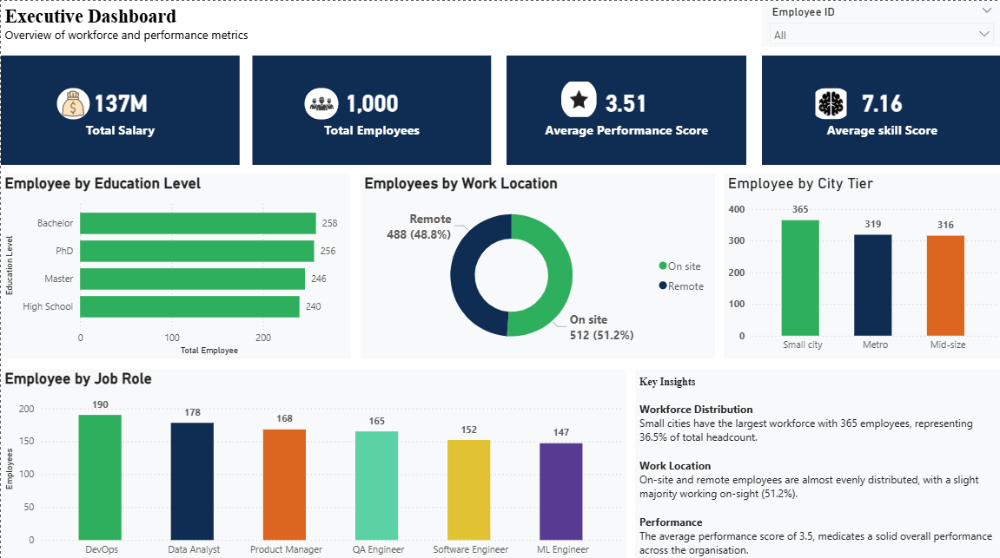
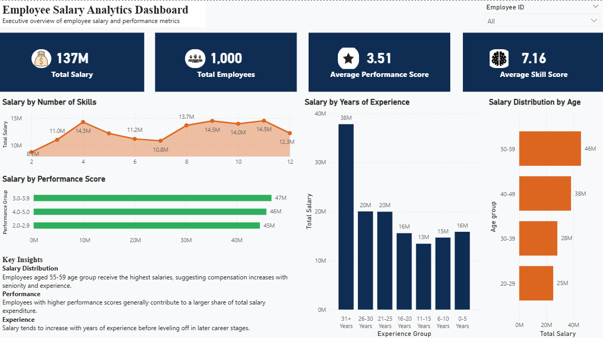
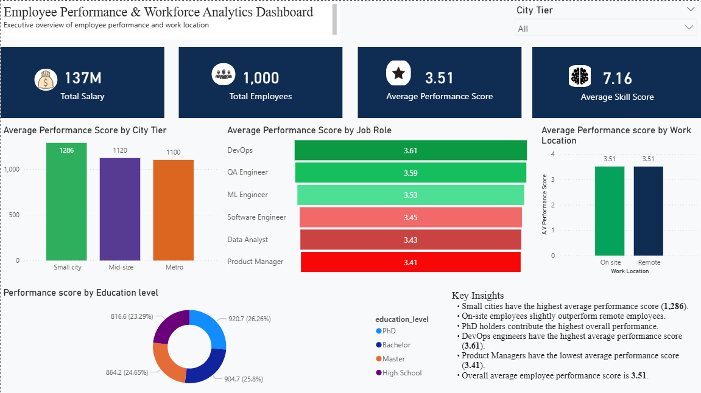

# Employee Performance & Workforce Analytics Dashboard

## Overview

This project presents an interactive **Employee Performance & Workforce Analytics Dashboard** built in **Microsoft Power BI**. The dashboard provides HR managers and business leaders with actionable insights into workforce performance, salary expenditure, employee demographics, education, work location, and experience.

The report is designed to support strategic workforce planning, performance monitoring, and data-driven decision-making through an intuitive and interactive dashboard.

---

## Dashboard Preview

### Executive Dashboard



### Employee Salary Analytics Dashboard



### Employee Performance & Workforce Analytics Dashboard



---

## Business Problem

Organizations often struggle to consolidate workforce information into a single reporting solution. HR leaders need visibility into:

- Overall workforce performance
- Salary distribution
- Employee demographics
- Performance by job role
- Workforce location distribution
- Education and experience trends

This dashboard centralizes these insights to help management make informed workforce and compensation decisions.

---

## Project Objectives

- Monitor workforce performance across multiple dimensions.
- Analyze salary expenditure by age, experience, and performance.
- Compare employee performance across job roles and education levels.
- Evaluate workforce distribution by city tier and work location.
- Build an interactive dashboard that supports executive decision-making.

---

# Dashboard Pages

## 1. Executive Dashboard

Provides a high-level overview of the organization's workforce.

### KPIs

- Total Salary
- Total Employees
- Average Performance Score
- Average Skill Score

### Visuals

- Employees by Education Level
- Employees by Work Location
- Employees by City Tier
- Employees by Job Role

### Key Insights

- Small cities have the largest workforce.
- On-site and remote employees are almost evenly distributed.
- DevOps has the highest employee count.
- Workforce education levels are relatively balanced.

---

## 2. Employee Salary Analytics Dashboard

Focuses on salary expenditure across different employee characteristics.

### KPIs

- Total Salary
- Total Employees
- Average Performance Score
- Average Skill Score

### Visuals

- Salary by Number of Skills
- Salary by Years of Experience
- Salary Distribution by Age
- Salary by Performance Score

### Key Insights

- Employees aged **50–59** receive the highest total salary.
- Salary generally increases with years of experience.
- Higher-performing employees contribute a larger share of salary expenditure.
- Employees with more skills tend to earn higher salaries.

---

## 3. Employee Performance & Workforce Analytics Dashboard

Analyzes employee performance across workforce characteristics.

### KPIs

- Total Salary
- Total Employees
- Average Performance Score
- Average Skill Score

### Visuals

- Average Performance Score by City Tier
- Average Performance Score by Job Role
- Average Performance Score by Work Location
- Performance Score by Education Level

### Key Insights

- Small cities record the highest average performance score.
- On-site employees slightly outperform remote employees.
- PhD holders contribute the highest overall performance.
- DevOps engineers have the highest average performance score.
- Product Managers have the lowest average performance score.

---

## Features

- Interactive slicers
- Executive KPI cards
- Dynamic filtering
- Clean and modern dashboard design
- Responsive visuals
- Business-focused insights

---

## Tools Used

- Microsoft Power BI
- Power Query
- DAX
- Data Modeling
- Data Visualization

---

## Skills Demonstrated

- Data Cleaning
- Data Transformation
- Data Modeling
- DAX Measures
- Dashboard Design
- KPI Development
- Business Intelligence
- Data Storytelling
- HR Analytics
- Executive Reporting

---

## Business Recommendations

- Review compensation structures across experience levels.
- Develop targeted training for lower-performing departments.
- Investigate the factors driving strong DevOps performance.
- Continue monitoring workforce distribution to support future hiring strategies.
- Use education and performance insights to improve talent development programs.

---

## Repository Contents

```
📂 Employee-Performance-Analytics-Dashboard
│
├── Employee_Performance_Dashboard.pbix
├── Executive_Dashboard.png
├── Salary_Dashboard.png
├── Performance_Dashboard.png
├── README.md
└── Dataset.xlsx
```

---

## How to Use

1. Download the repository.
2. Open the `.pbix` file using Microsoft Power BI Desktop.
3. Refresh the dataset if required.
4. Interact with slicers and visuals to explore workforce insights.

---

## Author

**Peter Makanjuola**

Aspiring Data Analyst passionate about transforming data into actionable business insights using Power BI, Excel, SQL, and data visualization.

---

## Connect With Me

- LinkedIn: *(Add your LinkedIn URL)*
- GitHub: https://github.com/Peterlyst
